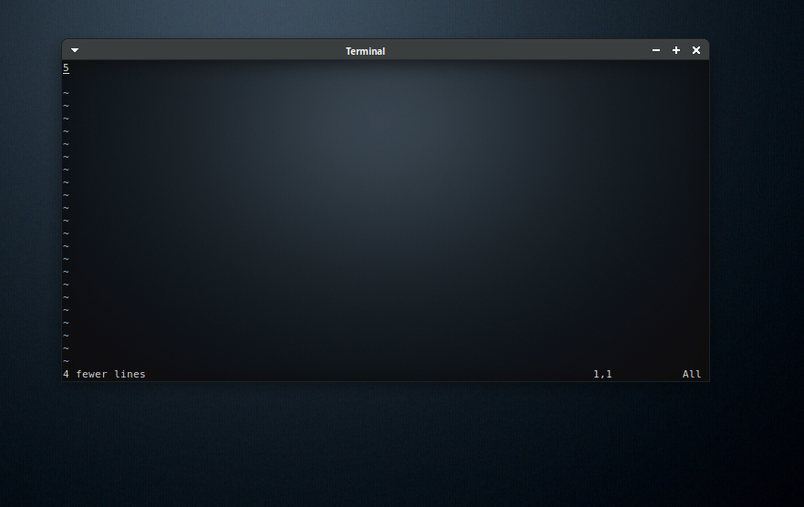
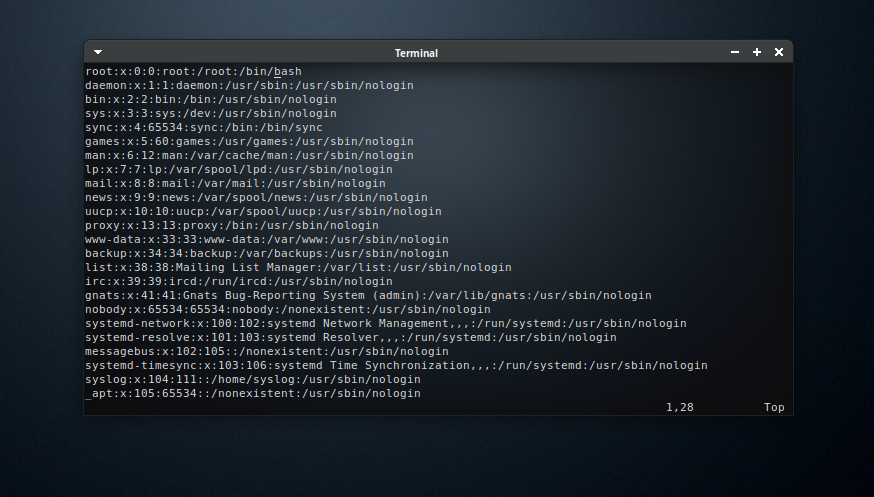

# Linux SYS_ADMIN Notes

#### This is My own Notes

#### This Repo Structed by days

---

## Day 1 : was Basics info & installation ;

## Day 2 & Day 3 :  Basics Commands ;

### Command Line Basics :

1. __`pwd`__
   
   ```bash
   $: pwd
   /home/xy
   ```

2. __`ls`__
   
   ```bash
   ls
   DBFiles  file1
   ```

3. **`su`**
   
   ```bash
   # Switch from user to nother user
   $: whoami # command tell you who are you .
   root 
   $: su - xy  # i will be xy user  
   ```

4. **`cal`**
   
   ```bash
   cal 2017
         January               February               March          
   
     Su Mo Tu We Th Fr Sa  Su Mo Tu We Th Fr Sa  Su Mo Tu We Th Fr Sa  
     1  2  3  4  5  6  7            1  2  3  4            1  2  3  4  
     8  9 10 11 12 13 14   5  6  7  8  9 10 11   5  6  7  8  9 10 11  
     15 16 17 18 19 20 21  12 13 14 15 16 17 18  12 13 14 15 16 17 18  
     22 23 24 25 26 27 28  19 20 21 22 23 24 25  19 20 21 22 23 24 25  
     29 30 31              26 27 28              26 27 28 29 30 31     
   
          April                  May                   June          
   
   Su Mo Tu We Th Fr Sa  Su Mo Tu We Th Fr Sa  Su Mo Tu We Th Fr Sa  
                      1      1  2  3  4  5  6               1  2  3  
    2  3  4  5  6  7  8   7  8  9 10 11 12 13   4  5  6  7  8  9 10  
    9 10 11 12 13 14 15  14 15 16 17 18 19 20  11 12 13 14 15 16 17  
   16 17 18 19 20 21 22  21 22 23 24 25 26 27  18 19 20 21 22 23 24  
   23 24 25 26 27 28 29  28 29 30 31           25 26 27 28 29 30     
   30                                                                
   
           July                 August              September        
   
   Su Mo Tu We Th Fr Sa  Su Mo Tu We Th Fr Sa  Su Mo Tu We Th Fr Sa  
                      1         1  2  3  4  5                  1  2  
    2  3  4  5  6  7  8   6  7  8  9 10 11 12   3  4  5  6  7  8  9  
    9 10 11 12 13 14 15  13 14 15 16 17 18 19  10 11 12 13 14 15 16  
   16 17 18 19 20 21 22  20 21 22 23 24 25 26  17 18 19 20 21 22 23  
   23 24 25 26 27 28 29  27 28 29 30 31        24 25 26 27 28 29 30  
   30 31                                                             
   
         October               November              December        
   
   Su Mo Tu We Th Fr Sa  Su Mo Tu We Th Fr Sa  Su Mo Tu We Th Fr Sa  
    1  2  3  4  5  6  7            1  2  3  4                  1  2  
    8  9 10 11 12 13 14   5  6  7  8  9 10 11   3  4  5  6  7  8  9  
   15 16 17 18 19 20 21  12 13 14 15 16 17 18  10 11 12 13 14 15 16  
   22 23 24 25 26 27 28  19 20 21 22 23 24 25  17 18 19 20 21 22 23  
   29 30 31              26 27 28 29 30        24 25 26 27 28 29 30  
                                               31 
   ```

5. **`date`**
   
   ```bash
   date
   Wed Jan 24 12:09:14 PM EET 2024
   ```

6. **`eject`** __disconnect with removable media__
   
   ```bash
   eject # eject only opens CD-ROM 
   eject /dev/sda # disconnect with sda drive 
   ```


7. `TTY`'s and `chvt`
   
   ```bash
   tty # Get TTY number I in 
   chvt 5 # Change From TTY I in to TTY 5
   ```

### Linux File SYS Structure


* `home`    : home Direcetory of any user will be created

* `root`    :  root's Direcetory only for him 

* `boot`    :  boot files There

* `etc`      :  every Configration will be saved into it

* `bin`      : all bin files there 

* `sbin`    : system binarys For root only

* `dev`      :  devices file + Special Files ex __`/dev/null`__,__`/dev/zero`__ and more
  
  >           __`EVERY THING IS FILE in Linux`__

* `tmp`      : temp files 

* `usr`      : Shared File between users 

* `var`      : variable files for services Like Apache , FTP , SMTP , and so on  

* `media` , `mount` , `mnt`  : Mounting Points 
  
  ```bash
  mount /dev/sda1 /mnt/
  mount /dev/sdb1 /media/
  mount /dev/sdc1 /mount/
  or any another endpoint
  mount /dev/sda3 /usr/local_mount/
  ```

* `run` ,`sys` , `proc`   :  Kernel handle then + services info there and Hardware info There  

* `opt`,`srv`      : optinal files __you can remove it___

* `lib`      :  Library files like for __`iostream`__ for c++ and so on with another lang 

---

### some Short-Cuts

```bash
SHORT-CUTs
cd - # return you into last directory you was there
cd ~username == cd /home/username 
touch file1 # Creating New file called file1 
touch file{1..4} # Create 4 Files starts from 1 to 4 called fileX
mkdir dir{1..50..2}#  for i=1 ; i>50 ; i+2
Demo :
$: touch file{15..300..15}
$: ls 
file105  file135  file150  file180  file210  file240  file270  file30   file45  file75
file120  file15   file165  file195  file225  file255  file285  file300  file60  file90
```

---

## Day 4 : More Commands

`Tree` show directroy as tree 

```bash
root@G580:/var/log/mysql# tree
.
├── error.log
├── error.log.1.gz
├── nothing
│   ├── nothing1
│   ├── nothing2
│   ├── nothing3
│   ├── nothing4
│   └── nothing5
└── testing
    ├── file1
    ├── file2
    ├── file3
    ├── file4
    └── file5

2 directories, 12 files
```

`mkdir`  : Make Directory 

```bash
mkdir new_dir # make new dir called new_dir 
mkdir newfile{1..4} # make new 4-directorys called new_dir1,new_dir2_newdir_3,new_dir4
mkdir temp/dir # if temp not already directory exists will get error to fix this use -p 
# if perant dir not even exist create him and same with chiled who's perant to who's under him 
# like temp is perant to dir and dir is child for temp but perant for testing and so on  
mkdir -p temp/dir/testing/nothing/
```

`cp`  : copy 

```bash
cp source desctnation
cp /file/ /backup_file/
# when trying to use cp with directorys like make backup from /etc/
# use 
cp -R /etc/ /backup/
# if you wanna copy dir with special name 
cp -r /etc/ /backup/new_etc
```

`cat` : reading text files

```bash
root@G580:~# cat msg 
This is msg file and you can read me using cat msg :) .
```

`mv` it's `cp` but cp don't delete source

```bash
root@G580:~/labs# touch file{1..4}
root@G580:~/labs# mkdir back_up
root@G580:~/labs# tree
.
├── back_up
├── file1
├── file2
├── file3
└── file4
1 directory, 4 files
root@G580:~/labs# mv file* back_up/
root@G580:~/labs# tree
.
└── back_up
    ├── file1
    ├── file2
    ├── file3
    └── file4
1 directory, 4 files
```

---

## Day 5 : Basics Administration

#### info :

> **Normal users** There ID-Range : Starts From 1000
> 
> **root** His ID only 0
> 
> **Services** There ID-Range : From 1 To 999

- > all users saved in etc/passwd

- ```bash
  cat /etc/passwd
  xy:x:1000:1000:xy,,,:/home/xy:/bin/bash
  mysql:x:132:139:MySQL Server,,,:/nonexistent:/bin/false
  geoclue:x:133:140::/var/lib/geoclue:/usr/sbin/nologin
  ```

### Basics Commands with users

#### `useradd` :

> users info saved into `/etc/passwd`

```bash
# Basics user addition
useradd web_adm_usr
# after adding group and want to add new user in this group 
useradd -g WebAD web_adm_usr # web_adm_usr will be in WebAD group
# WebAD group will be The Primary Group for web_adm_usr
userdel web_adm_usr # will remove user but leave his dir
userdel web_adm_usr -r # remove everything for this user 
```

#### `groupadd` :

> groups info saved into `/etc/group`

```bash
groupadd DCAdmins
groupadd NetwrokAdmins
groupadd DBadmins
groupadd WebAD
```

#### `usermod` & `groupmod` to edit user & groups

```bash
# u have been added web_adm_usr
# so to add him to more then one group "Secondary Groups"
# use -G to add only one secondary group 
$: useradd web_adm_usr
$: id web_adm_ur
# userID                Primary Group ID(name)  Seconday Groups
uid=1001(web_adm_usr)   gid=1005(web_adm_usr)   groups=1005(web_adm_usr)
# when you use only -G he add update old seconday Group by new group and add both
$: usermod -G DCADM web_adm_usr
$: id web_adm_usr
uid=1001(web_adm_usr) gid=1005(web_adm_usr) groups=1005(web_adm_usr),1002(DCADM)
$: usermod -G NETAD web_adm_usr
$: id web_adm_usr
uid=1001(web_adm_usr) gid=1005(web_adm_usr) groups=1005(web_adm_usr),1003(NETAD)
#if you looked at secondary Group you will see it's replaced old one by new one
# to Fix this use -a with -G 
$: usermod -aG DCADM web_adm_usr
$: id web_adm_usr
# added more then one in secondary group
uid=1001(web_adm_usr) gid=1005(web_adm_usr) groups=1005(web_adm_usr),1002(DCADM),1003(NETAD)
# to replace old primary group use -g in usermod
$: usermod -g DCADM web_adm_usr
$: id web_adm_usr
uid=1001(web_adm_usr) gid=1002(DCADM) groups=1002(DCADM),1003(NETAD)
# so -g for Primary -G for Seconday *u can use -a with -g* you only have a one primary group


# renameing groups
groupmod -n "WEB_DEV" web_developers
```

#### reading `etc/passwd`

```bash
$: cat /etc/passwd
web_adm_usr:x:1001:1002::/home/web_adm_usr:/bin/sh
web_adm_usr : # user name
x: # is password but to more secure added x 
# and hash of passwords will be in /etc/shadow
#like my xy user password is $y$j9T$7r1EbrB9cAiFRIMAgkoI3.$DzvR9nLYCJGRK9oZa0iUWHAEhnhFeSqMApeUF51ExVC:19714:0:99999:7:::
# it's 123 :) and hash algorithms is SHA
1001 : # it's usrID 
1002 : # it's Primary group ID 
# between 1001 , 1002 it's a desription for user called GECOS Field  
# to add description use useradd -c or usermod -c 
usermod -c "this a web admin user" web_adm_usr 
$: tail  -n 1 /etc/passwd
web_adm_usr:x:1001:1003:this a web admin user:/home/web_adm_usr:/bin/sh
/home/web_adm_usr : # it's a home directory for this user
/bin/sh : # it's user shell path 
```

> users passwords will be in /etc/shadow
> 
> and groups passwords in /etc/gshadow 

### Permissions

```bash
We Have 3 permissions on any File 
1. User OWNER => RWX
2. Group OWNER => RWX
3. Other => RWX
and 1st 3 bits For user & 2nd 3 bits For Group & 3rd 3 Bits For Other & First bit For File Type
---------------------------------------------------------
-rw-r--r--
R = Read
W = Write 
X = Execute
- = File Type (- = normal File , d = Directory , b = Block Device , c = Char Device , l = Link File )
# char device like keyboard 
$: ll /dev/tty1 
crw--w---- 1 root tty 4, 1 Jan 24 08:19 /dev/tty1
# blok device like HardDisk or USB or floppy Disk
$: ll /dev/sda
brw-rw---- 1 root disk 8, 0 Jan 24 08:19 /dev/sda
Reading Permissions :
-rw-r--r--
    - File Type = normal File 
    rw- = user  can Read & Write on this File 
    r-- = Group can Read Only This File
    r-- = Other have same Group Permission 

Reading Permissions 
$: ls -la # some Linux Distro adding ll and do the same job of ls -la 
# to add ll Manual use alial 
$: alias ll="ls -la"
$: ll
total 8
drwxr-xr-x 2 root root 4096 Jan 23 16:31 .
drwxr-xr-x 3 root root 4096 Jan 23 16:31 ..
-rw-r--r-- 1 root root    0 Jan 23 16:31 file1
-rw-r--r-- 1 root root    0 Jan 23 16:31 file2
-rw-r--r-- 1 root root    0 Jan 23 16:31 file3
-rw-r--r-- 1 root root    0 Jan 23 16:31 file4

# Explaining
-rw-r--r-- 1 root root    0 Jan 23 16:31 file4
0. drwxr #File Type 
1.-rw-r--r-- # Permissions Read Write Execute
2. 1 # Link Counter
3. root # USER  OWNER
4. root # Group OWNER
5. 0 # file Size
6. Jan 23 16:31 # Last Access not Modifition Time
7. File4 # file name
```

#### Edit Permissions

```bash
$: ll file1 
-rw-r--r-- 1 root root 0 Jan 23 16:31 file1
$: chmod o+wx file1 
$: ll file1 
-rw-r--rwx 1 root root 0 Jan 23 16:31 file1*
$: chmod {a or }{+,-}{w,r,x} file1 # will remove x permission from all of them 
chmod a-x file1 # file1 will be file without exec permission
chmod ugo+wr,o-wrx # owner & group will get wr permissions and o will be null
# to apply permissions in all things in speical dir use -R 
$: chmod go-rwx
$: ll
drwx------ 2 root root 4096 Jan 24 10:42 DBFiles/
$: ll DBFiles/
-rw-r--r-- 1 root root    0 Jan 24 10:42 file1.db
-rw-r--r-- 1 root root    0 Jan 24 10:42 file2.db
-rw-r--r-- 1 root root    0 Jan 24 10:42 file3.db
-rw-r--r-- 1 root root    0 Jan 24 10:42 file4.db
# Directory got removed GO permissions but File who's inside This Dir not got the same permissions 
# to make all dir and the file inside this dir use -R
$: chmod -R go-wrx,u+rwx DBFiles/
$: ll
total 12
drwxr-xr-x 3 root root 4096 Jan 24 10:42 ./
drwxr-xr-x 3 root root 4096 Jan 23 16:31 ../
drwx------ 2 root root 4096 Jan 24 10:42 DBFiles/
$: ll DBFiles/
total 8
drwx------ 2 root root 4096 Jan 24 10:42 ./
drwxr-xr-x 3 root root 4096 Jan 24 10:42 ../
-rwx------ 1 root root    0 Jan 24 10:42 file1.db*
-rwx------ 1 root root    0 Jan 24 10:42 file2.db*
-rwx------ 1 root root    0 Jan 24 10:42 file3.db*
-rwx------ 1 root root    0 Jan 24 10:42 file4.db* 
```

#### file Permissions

| Symbol | means                                          |
|:------:|:----------------------------------------------:|
| read   | View                                           |
| write  | edit , del , overload , any kind under editing |
| exec   | run file                                       |

#### Direcotry Permissions

| Symbol | means                                        |
|:------:|:--------------------------------------------:|
| read   | ls this dir                                  |
| write  | add , Remove , Delete Directory              |
| exec   | cd dir , ls -l dir _-l :Long Listing Format_ |

#### `chown` : Change Ownership on files or Dir

```bash
chown username:group {filename,dir}
$: ll
drwx------ 2 root root 4096 Jan 24 10:42 DBFiles/
$: chown web_adm_usr:WEBAD DBFiles/
$: ll
drwx------ 2 web_adm_usr WEBAD 4096 Jan 24 10:42 DBFiles/
# changeing group only
chown :WEBAD DBFiles/
```

### Permission $Kind$

1. Symbolic Method 

2. Numeric method 

#### Symbol :

user owner =  $u$

group owner =  $g$

other = $o$ 

#### Numeric :

| Syntax | number |
|:------:|:------:|
| r      | 4      |
| w      | 2      |
| x      | 1      |

> U,G,O Every one of them have this 3 Numbers 4,2,1 

```bash
chmod 775 file1
# means user=rwx
# means Group=rwx
# means Other=rx
$: touch file1 
$: chmod 775 file1 
$: ll
total 12
-rwxrwxr-x 1 root root    0 Jan 24 11:48 file1*
```

## Day 6 :  Redicetion

### Descriptor

| symbol | number |
|:------:|:------:|
| input  | 0      |
| output | 1      |
| error  | 2      |

### output redirection

```bash
ls > ls_out # if ls_out not exists will be created and save output from ls
ls askdbasd 2> ls_out # 2> for redirect errors
*> == 1> *
ls File dir_not_exits >resuilt 2>errors
ls File dir_not_exits 2&>>all_Resuilt
# when using > he overload file
# but >> same old and add new 
```

### input

```bash
# defualt input is null 
cat < file == cat file
*reading and adding using cat*
cat <<EOT>> new_file
# new file 
# adding new file 
# anything new 
# EOT
# cat << ; for adding on old content not overloading 
# EOT just text to tell bash when see EOT stop reading 
# after stop reading will redirect using EOT>> new_file
 cat <<addedby me >> file
```

> explaned this commands
> 
> 1. more : seeing file + auto close 
> 
> 2. less : seeing file + manual close
> 
> 3. | between 2 commands
> 
> 4. tee with ls & | 
>    
>    1. ls | tee -a resuilt.txt     *-t for don't overloading*
>       
>       _this command will return resuilt into screen and save output into resuilt_
> 
> 5. w : whois login + some info 
> 
> 6. who : whois login into system and running 
> 
> 7. whoami or who am i 
> 
> 8. whatis {ls , pwd , chmod , chown}
> 
> 9. whereis {{ls , pwd , chmod , chown} return binary bath
> 
> 10. last 

---

## Day 7 & Day 8

> MBR <Master Boot Record>
> 
> Have 3 Spaces :
> 
> Partition Table __For Knowing The Start and The End of this partitions & disk__
> 
> **Partition Table is removed that's mean you hard Disk got formated**
> 
> **FILE SYSTEMs**  : `NTFS` , `EXT` , `ETX32` and so on see [There](https://en.wikipedia.org/wiki/File_system) For **More**
> 
> For Every Partition we have **Inode Table** and  it's normal table store info of anything will be stored in this partition 
> 
> 1 Parition Table it's store strart x to end y and Block number x+15 have data with permission RWX for user and RW for other and - - - For Group  and more info for any thing will be stored in this blcoks  "Metadata"
> 
> ---
> 
> Let's Collect this 
> 
> We have MBR and MBR Have Partition Table for Every Partition to know The Start And The End for this Partitions  and every Partition Table Have his own speically Inode Table And Inode Table have all informatoin in every Sector Or Block whatever in this space inside Partition 
> 
> ex : HHD = 400G 
> 
> 4 Partitions 
> 
> MBR Will store From 0 to 100 this partition 1 and so on for partition 4
> 
> and For Every PartitionX have Inode Table and this table Store all blocks From X to x+100
> 
> __If Inode Table To corrupted__ This Partition only got stoped and don't work anymore but if you formated it Kernel Will Create New Partition Table and send it to MBR and remove Corrupted __INODE TABLE__ and add new **INODE TABLE** 

### Seeing Partition Table

```bash
$: fdisk -l /dev/sda
Disk /dev/sda: 465.76 GiB, 500107862016 bytes, 976773168 sectors
Disk model: ST500LT012-9WS14
Units: sectors of 1 * 512 = 512 bytes
Sector size (logical/physical): 512 bytes / 4096 bytes
I/O size (minimum/optimal): 4096 bytes / 4096 bytes
Disklabel type: gpt
Disk identifier: B0CFC205-CDE7-47F1-9670-7F1A64BA0BB2

Device         Start       End   Sectors   Size Type
/dev/sda1       2048   9764863   9762816   4.7G EFI System
/dev/sda2    9764864  19529727   9764864   4.7G BIOS boot
/dev/sda3   19529728  39061503  19531776   9.3G Linux swap
/dev/sda4   39061504 332029951 292968448 139.7G Linux filesystem
/dev/sda5  332032000 490639359 158607360  75.6G Linux filesystem
/dev/sda6  490639360 976773119 486133760 231.8G Microsoft basic data
# fdisk -list device 
return 
    1. device or partition name "in Linux /dev/sdX"
    2. Start and of this partition
    3. Sector = Hard SIze / sector size = how many block you have you will use it with LVM 
    4. size this of all partition not what i used in this partition
    5. File System Type     
```

### Seaing INODE-Number

```bash
$: ls -li 
total 4
131090 drwxr-xr-x 3 root root 4096 Jan 24 11:48 back_up
# First Table is INODE-NUMBER and other we know what they are
```

> I-NODE != based on size of file  let's see what' i wanna tell You

```bash
$: df -hi 
# df -human-readable  -inode-number 
Filesystem     Inodes IUsed IFree IUse% Mounted on
/dev/sda4        8.8M  439K  8.4M    5% /
# now The I-Node in my / partition in /dev/sda4 
# This Partition It's Size is 8.8M and i only used 439K of 8.8M 
# so now only 439K used 95% of my space that's means 
# inode number don't use every Block and gave this block his own inode number
# no that mean you have large files and this files used space as well
# and you have free inode ex you can add Large number of empty files or small files in system  
$: df -h 
/dev/sda4       137G  123G  7.1G  95% /
```

### Real DEMO

```bash
# Let's see First inode table on / whois in /dev/sda4
$: df -i | grep "/dev/sda4"
/dev/sda4      9158656 448903 8709753    5% /
# we will use dd to write into file and make this files takes 2G
$: dd if=/dev/zero of=testing.inode bs=1M count=2024 status=progress
2090860544 bytes (2.1 GB, 1.9 GiB) copied, 19 s, 110 MB/s
2024+0 records in
2024+0 records out
2122317824 bytes (2.1 GB, 2.0 GiB) copied, 23.2707 s, 91.2 MB/s
# we write 2024MB into file called test.incode
# let's see inode table new using df -i 
$: df -i | grep "/dev/sda4"
/dev/sda4      9158656 448904 8709752    5% /
# look Here he used only 1 inode number to point to this file
# The i-node Table don't care about size of file
# he's only cares about number of files will use number of nodes 
# for more info 
$: touch file{1..50}
$: df -i | grep "/dev/sda4"
/dev/sda4      9158656 448954 8709702    5% /
# from 448904 to 448954 that exactly number of files we got created them 
# using touch and so on with every files and directory you working with them
```

### Soft Links & Hard Link

---

#### Soft Link

>  soft link and hard link it's like shortcut in Windows 

#### Demo :  Hard Link

```bash
------------------------------- Hard Link -------------------------------
df -i | grep "/dev/sda4" # for seaing inode number before adding file
/dev/sda4      9158656 446866 8711790    5% /
$: touch file1
$:  df -i | grep "/dev/sda4"
/dev/sda4      9158656 446867 8711789    5% /
# inode number from 446866 to 446867 that's mean we used inode number for file 
$: ls -li # show i node number of file1 before hard linking  
total 0
131077 -rw-r--r-- 1 root root 0 Jan 25 12:03 file1
$: ln file1 file2
$: ls -li 
total 0
131077 -rw-r--r-- 2 root root 0 Jan 25 12:03 file1
131077 -rw-r--r-- 2 root root 0 Jan 25 12:03 file2 
# They Have The same inode number in "hard link"
while rm -rf file1 , file2 still have access to this data why ?
# while removing any file OS don't remove there data
# it's only delete the falg on this inodes and set them as free 
# so when we created 2 files point to the same file OS removed lable1 but still see lable2 on file2
# when removing file2 data still in sys but can't access it 
# someting like pointer in c++ when creaing new memory allocator you should delete it after done work    
```

#### Demo : Soft Link

```bash
------------------------------- Soft Link -------------------------------
$: ln -s file1 file2 
$: ll -i
131077 -rw-r--r--  1 root root     10 Jan 25 12:10 fil1
131085 lrwxrwxrwx  1 root root      4 Jan 25 12:14 file2 -> fil1
# every file have how own inode number 
# you can remove child links but when remove perant link child link don't know where they will go 
$: rm -rf fil1  # will remove perant link so when open file2 
$: cat file2 
cat: file2: No such file or directory
# while removing child link 
$: ln -s main_soft child
$: ll -i 
total 140
131084 drwxr-xr-x  2 root root 131072 Jan 25 12:22 ./
131073 drwx------ 10 root root   4096 Jan 25 12:10 ../
131085 lrwxrwxrwx  1 root root      9 Jan 25 12:22 child -> main_soft
131077 -rw-r--r--  1 root root     11 Jan 25 12:21 main_soft
# main_soft & child have diffrent inode number 
$: echo "soft link" > main_soft
$: ll -i main_soft child 
131085 lrwxrwxrwx 1 root root  9 Jan 25 12:26 child -> main_soft
131077 -rw-r--r-- 1 root root 10 Jan 25 12:24 main_soft
$: cat child main_soft 
soft link 
soft link
$: echo "adding comment" >> child 
$: cat child main_soft 
soft link
adding comment
soft link
adding comment
$: rm -rf child 
$: ll -i main_soft child 
ls: cannot access 'child': No such file or directory
131077 -rw-r--r-- 1 root root 25 Jan 25 12:26 main_soft
$: cat main_soft 
soft link
adding comment
# still have main_soft content but child got removed
```

> bin and system bin are Soft link for /usr/bin

```bash
ll -i /
total 157292
      2 drwxr-xr-x  20 root root      4096 Jan 23 16:24 ./
      2 drwxr-xr-x  20 root root      4096 Jan 23 16:24 ../
     12 lrwxrwxrwx   1 root root         7 Dec 23 11:16 bin -> usr/bin/
7340033 drwxr-xr-x   4 root root      4096 Dec 25 06:43 boot/
2621441 drwxrwr-x   2 root root      4096 Dec 23 11:22 cdrom/
   3010 -rw-------   1 root root 197763072 Dec 29 22:22 core.831
      1 drwxr-xr-x  21 root root      5060 Jan 25 08:03 dev/
 786433 drwxr-xr-x 170 root root     12288 Jan 24 20:48 etc/
2359297 drwxr-xr-x   3 root root      4096 Dec 23 11:23 home/
     13 lrwxrwxrwx   1 root root         7 Dec 23 11:16 lib -> usr/lib/
     14 lrwxrwxrwx   1 root root         9 Dec 23 11:16 lib32 -> usr/lib32/
     15 lrwxrwxrwx   1 root root         9 Dec 23 11:16 lib64 -> usr/lib64/
     16 lrwxrwxrwx   1 root root        10 Dec 23 11:16 libx32 -> usr/libx32/
     11 drwx------   2 root root     16384 Dec 23 11:16 lost+found/
6029313 drwxr-xr-x   3 root root      4096 Dec 23 11:31 media/
1835009 drwxr-xr-x   3 root root      4096 Jan 19 23:45 mnt/
6815745 drwxr-xr-x   3 root root      4096 Jan  6 09:36 opt/
      1 dr-xr-xr-x 311 root root         0 Jan 25 08:02 proc/
 131073 drwx------  10 root root      4096 Jan 25 12:10 root/
      1 drwxr-xr-x  43 root root      1200 Jan 25 11:41 run/
     17 lrwxrwxrwx   1 root root         8 Dec 23 11:16 sbin -> usr/sbin/
3407873 drwxr-xr-x  30 root root      4096 Jan 22 14:45 snap/
 262145 drwxr-xr-x   2 root root      4096 Aug  9  2022 srv/
      1 dr-xr-xr-x  13 root root         0 Jan 25 08:02 sys/
1048577 drwxrwxrwt  16 root root      4096 Jan 25 12:09 tmp/
3538945 drwxr-xr-x  16 root root      4096 Dec 23 12:43 usr/
1179649 drwxr-xr-x  15 root root      4096 Jan  3 21:12 var/
--------------------------------------------------------------------------
$: ll -i /lib
13 lrwxrwxrwx 1 root root 7 Dec 23 11:16 /lib -> usr/lib/
$: ll -i /usr/ | grep lib/
3538949 drwxr-xr-x 131 root root  4096 Jan 20 21:18 lib/
# /lib and /usr/lib are soft link
# when remove /lib whois under / nothing gonna happen .  
```

> - hard link not working with directorys but soft works 
> 
> - ln mydir/ hardlink != ls -s mydir/ softlink 
> 
> - *while using soft link* you should use absolute path

---

## Day 9

### Showing Disks

```bash
$: lsblk <list-Block>
NAME            MAJ:MIN RM  SIZE RO TYPE MOUNTPOINT
sda               8:0    0    8G  0 disk 
├─sda1            8:1    0    1G  0 part /boot
└─sda2            8:2    0    7G  0 part 
  ├─centos-root 253:0    0  6.2G  0 lvm  /
  └─centos-swap 253:1    0  820M  0 lvm  [SWAP]
sdb               8:16   0   20G  0 disk 
└─sdb1            8:17   0   10G  0 part 
sdc               8:32   0   15G  0 disk 
sdd               8:48   0   10G  0 disk 
sr0              11:0    1 1024M  0 rom  
# for Showing Special file use fdisk -l 
# fdisk used for showing disks and mange disks 
$: fdisk -l /dev/sdb # Showing Disk Description
Disk /dev/sdb: 21.5 GB, 21474836480 bytes, 41943040 sectors
Units = sectors of 1 * 512 = 512 bytes
Sector size (logical/physical): 512 bytes / 512 bytes
I/O size (minimum/optimal): 512 bytes / 512 bytes
Disk label type: dos
Disk identifier: 0xbf56859a
   Device Boot      Start         End      Blocks   Id  System
$: fdisk /dev/sdb # Editing Disk
Welcome to fdisk (util-linux 2.23.2).

Changes will remain in memory only, until you decide to write them.
Be careful before using the write command.


Command (m for help): m
Command action
   a   toggle a bootable flag
   b   edit bsd disklabel
   c   toggle the dos compatibility flag
   d   delete a partition
   g   create a new empty GPT partition table
   G   create an IRIX (SGI) partition table
   l   list known partition types
   m   print this menu
   n   add a new partition
   o   create a new empty DOS partition table
   p   print the partition table
   q   quit without saving changes
   s   create a new empty Sun disklabel
   t   change a partition's system id
   u   change display/entry units
   v   verify the partition table
   w   write table to disk and exit
   x   extra functionality (experts only)
Command (m for help):
```

__After Booting kernel don't re-scan Automatic we should tell Kernel Got To MBR and Re-Scan Partition Table__ we will use `partprobe`

### Creating File System

```bash
mkfs.ext4 /dev/sdb1
mke2fs 1.42.9 (28-Dec-2013)
Filesystem label=
OS type: Linux
Block size=4096 (log=2)
Fragment size=4096 (log=2)
Stride=0 blocks, Stripe width=0 blocks
983040 inodes, 3932160 blocks
196608 blocks (5.00%) reserved for the super user
First data block=0
Maximum filesystem blocks=2151677952
120 block groups
32768 blocks per group, 32768 fragments per group
8192 inodes per group
Superblock backups stored on blocks: 
    32768, 98304, 163840, 229376, 294912, 819200, 884736, 1605632, 2654208

Allocating group tables: done                            
Writing inode tables: done                            
Creating journal (32768 blocks): done
Writing superblocks and filesystem accounting information: done   
```

### Formating Disk

```bash
cat /dev/random >> /dev/sdX 
# if you used it with patition ex /dev/sda3 that's mean you want to delete inode table not partition table
# using dd
dd if=/dev/sdX of=dev/sdX bs=512B count=1 status=progress 
dd : disk distory
if : input File
of : output File
bs : Block SIze 
count : how many Times You Wanna Me Write this Block SIze 
status : show me what you do 
```

### Check Disk using `e2fsck`

```bash
# you should use it with un mounted partitions 
use df -h or lsblk
$: df -h 
Filesystem               Size  Used Avail Use% Mounted on
devtmpfs                 232M     0  232M   0% /dev
tmpfs                    244M     0  244M   0% /dev/shm
tmpfs                    244M  4.6M  239M   2% /run
tmpfs                    244M     0  244M   0% /sys/fs/cgroup
/dev/mapper/centos-root  6.2G  1.5G  4.8G  23% /
/dev/sda1               1014M  137M  878M  14% /boot
tmpfs                     49M     0   49M   0% /run/user/0
$: lsblk 
NAME            MAJ:MIN RM  SIZE RO TYPE MOUNTPOINT
sda               8:0    0    8G  0 disk 
├─sda1            8:1    0    1G  0 part /boot
└─sda2            8:2    0    7G  0 part 
  ├─centos-root 253:0    0  6.2G  0 lvm  /
  └─centos-swap 253:1    0  820M  0 lvm  [SWAP]
sdb               8:16   0   20G  0 disk 
└─sdb1            8:17   0    5G  0 part 
sdc               8:32   0   15G  0 disk 
sdd               8:48   0   10G  0 disk 
sr0              11:0    1 1024M  0 rom  
we focus on sdb1
$: df -h | grep "sdb" & lsblk | grep "sdb" 
sdb               8:16   0   20G  0 disk 
└─sdb1            8:17   0    5G  0 part 
# now we can check *we check partitions not hard
# you should take backup first 
# backup using dd 
dd if=/devv/sdbX of=/backup
# checking
e2fsck -f /dev/sdb1
e2fsck 1.42.9 (28-Dec-2013)
Pass 1: Checking inodes, blocks, and sizes
Pass 2: Checking directory structure
Pass 3: Checking directory connectivity
Pass 4: Checking reference counts
Pass 5: Checking group summary information
/dev/sdb1: 11/327680 files (0.0% non-contiguous), 58462/1310720 blocks
```

##### e2fsck it's not scan data it's scan Inode table and restore the "super Block" who's created while using mkfs

#### Notes

##### While using dd with /dev/random or urandom != /dev/zero in `size`

```bash
$: dd if=/dev/zero of=/dev/sdb bs=512 count=1
1+0 records in
1+0 records out
512 bytes (512 B) copied, 0.00193723 s, 264 kB/s
$: dd if=/dev/random of=/dev/sdb bs=512 count=1
0+1 records in
0+1 records out
11 bytes  (11 B)  copied, 0.00128421 s, 8.6 kB/s
UTF-8 != ANSI
  512 != 11 
```

---

## Day 10

### Mounting

```bash
$: mount <device> <end-point>
   mount /dev/sdb1 /mnt/sdb1 
# MAX Size /mnt/sdb1 can use it's based on partition Size of /dev/sdb1 
```

#### umount

```bash
umount /dev/sdb3 /media or umount /data
```

#### mount -t

#### in the past with RHEL under 5

> you was should set file system type but now he's doing this without you "auto detect"

```bash
# use lsblk -f for showing file system then mount this file system
$: lsblk -f
NAME            FSTYPE      LABEL UUID                                   MOUNTPOINT
sda                                                                      
├─sda1          xfs               2f3759f6-7f31-44e4-bffb-6a27fc0a21bd   /boot
└─sda2          LVM2_member       aZyEsw-cvzc-YZIv-xZqV-LBzB-2nsx-esjTvQ 
  ├─centos-root xfs               2fe2f1bd-99c6-4e64-a59b-5a3c6423f9ee   /
  └─centos-swap swap              77b75f33-184e-4078-b6c3-63e423245f59   [SWAP]
sdb                                                                      
├─sdb1                                                                   
├─sdb2          ext4              25883b61-9fac-4bc8-946e-38af8bf1c020   /mnt/sdb2
├─sdb3          btrfs             3c16addf-c7bf-4f4b-a472-4db7f71886f5   
└─sdb5          xfs               7919a387-4d5f-4a68-a52d-a10eee8524d5   
sdc                                                                      
sdd                                                                      
sr0                                                                      
$: mount -t ext4 /dev/sdb2 /data
# if you trying to gave him not real file system he's will think you have bad file system and will tell you you should check logs using dmesg
$: dmesg
EXT4-fs (sdb2): mounted filesystem with ordered data mode. Opts: (null)
[ 1768.158115] EXT4-fs (sdb3): VFS: Can't find ext4 filesystem
```

### Fixing Mounting Bugs

__While replacing From Port to another Port Kernel will read new disk called sdbc not sdb so we will fix this using UUID or LableNAME__

```bash
$: lsblk 
NAME            MAJ:MIN RM  SIZE RO TYPE MOUNTPOINT
sda               8:0    0    8G  0 disk 
├─sda1            8:1    0    1G  0 part /boot
└─sda2            8:2    0    7G  0 part 
  ├─centos-root 253:0    0  6.2G  0 lvm  /
  └─centos-swap 253:1    0  820M  0 lvm  [SWAP]
sdb               8:16   0   20G  0 disk 
├─sdb1            8:17   0    1K  0 part 
├─sdb2            8:18   0    5G  0 part 
├─sdb3            8:19   0    5G  0 part 
└─sdb5            8:21   0    5G  0 part 
sdc               8:32   0   15G  0 disk 
sdd               8:48   0   10G  0 disk 
sr0              11:0    1 1024M  0 rom  
# we will focus on sdb5 we will need to find his UUID 
$: blkid
/dev/sda1: UUID="2f3759f6-7f31-44e4-bffb-6a27fc0a21bd" TYPE="xfs" 
/dev/sda2: UUID="aZyEsw-cvzc-YZIv-xZqV-LBzB-2nsx-esjTvQ" TYPE="LVM2_member" 
/dev/sdb2: UUID="25883b61-9fac-4bc8-946e-38af8bf1c020" TYPE="ext4" 
/dev/sdb3: UUID="3c16addf-c7bf-4f4b-a472-4db7f71886f5" UUID_SUB="879762a6-2602-4f0e-805b-d87d3b72d475" TYPE="btrfs" 
/dev/sdb5: UUID="7919a387-4d5f-4a68-a52d-a10eee8524d5" TYPE="xfs" 
/dev/mapper/centos-root: UUID="2fe2f1bd-99c6-4e64-a59b-5a3c6423f9ee" TYPE="xfs" 
/dev/mapper/centos-swap: UUID="77b75f33-184e-4078-b6c3-63e423245f59" TYPE="swap" 
# sdb5 UUID is : 7919a387-4d5f-4a68-a52d-a10eee8524d5
# adding lable name for /dev/sdb5 
e2label /dev/sdb5 oracel_db
```

##### For Mouting Using UUID

```bash
mount -U 7919a387-4d5f-4a68-a52d-a10eee8524d5 /media 
or 
mount uuid=7919a387-4d5f-4a68-a52d-a10eee8524d5 /media
# From mount help :  
$: mount --help | grep UUID
 -U, --uuid <uuid>       synonym for UUID=<uuid>
 UUID=<uuid>             specifies device by filesystem UUID
 PARTUUID=<uuid>         specifies device by partition UUID
# unmount 
lsblk | grep sdb 
sdb               8:16   0   20G  0 disk 
├─sdb1            8:17   0    1K  0 part 
├─sdb2            8:18   0    5G  0 part 
├─sdb3            8:19   0    5G  0 part 
└─sdb5            8:21   0    5G  0 part /media
[root@localhost ~]# umount  /media/
[root@localhost ~]# lsblk | grep sdb 
sdb               8:16   0   20G  0 disk 
├─sdb1            8:17   0    1K  0 part 
├─sdb2            8:18   0    5G  0 part 
├─sdb3            8:19   0    5G  0 part 
└─sdb5            8:21   0    5G  0 part 
```

### Adding Mounts into /etc/fstab

```bash
vim /etc/fstab
<dev> <end-point> <file system Type> <mount options> <dump order> <file system check order>
device : /dev/sdb3
endpoint : /media
type : ext4 or ext3 or xfs and so on 
mount options : read write (rw) , read only (ro) , executable (exec) , no executable (noexec) 
with noexec means don\'t run any binary files 
file sys check : o => 9
0 means don\'t do any check 1->9 means who\'s will be check first
 like if set 6 , partition number 6 have high privilege to be check fisrt than any partition else in the same disk 
dump older : 1 -> 9  For Backup while booting same like file system check 
/dev/sdb3 /media ext4 rw,ro,noexec,exec, 0->9 , 0->9
```

- when you edit fstab should after done edititng mount -a before reboot or shutdown

#### /etc/mtab

- have copy any thing have been mounted

```bash
$: lsblk /dev/sdb -f
NAME   FSTYPE LABEL UUID                                 MOUNTPOINT
sdb                                                      
├─sdb1                                                   
├─sdb2 ext4         25883b61-9fac-4bc8-946e-38af8bf1c020 
├─sdb3 btrfs        3c16addf-c7bf-4f4b-a472-4db7f71886f5 
└─sdb5 xfs          7919a387-4d5f-4a68-a52d-a10eee8524d5 
$: mount /dev/sdb2 /media/
$: tail -n 1 /etc/mtab 
/dev/sdb2 /media ext4 rw,seclabel,relatime,data=ordered 0 0
# you can copy this file and add it into /etc/fstab if you don't know syntax of fstab
$: cat /etc/fstab 
/dev/mapper/centos-root /                       xfs     defaults        0 0
UUID=2f3759f6-7f31-44e4-bffb-6a27fc0a21bd /boot                   xfs     defaults        0 0
/dev/mapper/centos-swap swap                    swap    defaults        0 0
$: tail -n 1 /etc/mtab >> /etc/fstab 
$: cat /etc/fstab 
/dev/mapper/centos-root /                       xfs     defaults        0 0
UUID=2f3759f6-7f31-44e4-bffb-6a27fc0a21bd /boot                   xfs     defaults        0 0
/dev/mapper/centos-swap swap                    swap    defaults        0 0
/dev/sdb2 /media ext4 rw,seclabel,relatime,data=ordered 0 0
[root@localhost ~]# 
```

---

### Compressing & Archive

### gzip VS bzip2

| name  | Compresstion Time | Extracting Time | ending size |
| ----- | ----------------- | --------------- | ----------- |
| bzip2 | Slow              | Slow            | smaller     |
| gzip  | Fast              | Fast            | bigger      |

#### *Compresstion VS Archiving*

#### Archiving : *means you Collect more then one files or dirctory in one file for fast Tranfer between 2 devices*

#### Compression : *means you wanna get small size of many files or directorys*

#### *Compressing don't works with imgs and videos*

### Demo :

```bash
# Creating big file for testing
$: ll -R / > file 2>/dev/null &
# show file size using du -sh 
$: du -sh file # or use ls -lah or ll -h 
89M    file
# Showing Time gzip will take while archiving
$: time gzip file 
real    0m1.544s
user    0m1.492s
sys    0m0.052s
$: time gunzip file.gz  
real    0m0.540s
user    0m0.393s
sys    0m0.060s
# now gzip takes 1.5 of extracting and .5
-------------------------------------------------------------
# Let's show bzip2
$: time bzip2 file 
real    0m15.277s
user    0m13.062s
sys    0m0.097s
$: time bunzip2 file.bz2 
real    0m2.430s
user    0m2.299s
sys    0m0.104s
# bzip2 archiving = 15 & extracting = 2.4

so Compresstion of : gzip / bzip2 = 1.5/15 & extracting = 2.4/.5
Size :
-rw-r--r-- 1 root root 9.2M Jan 28 10:22 file.gz 
-rw-r--r-- 1 root root 6.3M Jan 28 10:22 file.bz2
```

### Archiving using tar

```bash
tar cfv back_etc.tar /etc 
c : create 
f : file 
v : virbose 
# Showing Size of Both
$: du -sh /etc/ && ll -h file.bz2 
19M    /etc/
-rw-r--r-- 1 root root 6.3M Jan 28 10:22 file.bz2
# Time 
$: time tar cfv back_etc.tar /etc/
real    0m0.199s
user    0m0.036s
sys    0m0.064s
$: time tar xfv back_etc.tar
real    0m0.236s
user    0m0.028s
sys    0m0.192s
```

### tar with gzip and bzip

#### __I see tar faster then gzip and bzip2__

#### but i video tar was slower then both but i don't know how

#### tar + gzip : tar cfvz file.tar.gz  file

#### tar  + bzip : tar cfvj file.tar.bz2 file

#### extracting tar xvf{z,j} file.tar.{gz,bz2}

#### For Showing The Content use tar tvf{g,j} file.tar.{gz,bz2}

---

## Day 11

### - Process Mangement Basics

### Process' are 2 kind

1. child

2. perant

#### Any Process as Perant as itself , can Creat Threads so Threads called Child of Main Process

- Main Process Called PID <process ID> or <Perant ID> doesn't mater ;

any Linux Destro First PID is one of { "init" , "systemd" }

### ps

```bash
$: ps # return corrunt process from this terminal only
    PID TTY          TIME CMD
   7469 pts/2    00:00:00 bash
   7517 pts/2    00:00:00 ps
$: ps a # return all process from all any terminal for this user
# open terminal and run sleep 1555
sleep 1555 
# in another terminal use ps a to see sleep process
$: ps a 
    PID TTY      STAT   TIME COMMAND
   1185 tty7     Ssl+   3:28 /usr/lib/xorg/Xorg -core :0 -seat seat0 -auth /var/run/lightdm/root/:0 -
   1187 tty1     Ss+    0:00 /sbin/agetty -o -p -- \u --noclear tty1 linux
   3060 pts/0    Ss     0:00 bash
   7469 pts/2    Ss     0:00 bash
   7528 pts/0    S+     0:00 sleep 1555
   7531 pts/2    R+     0:00 ps a
```

#### ps aux

```bash
$: ps aux  # return : 
USER  PID %CPU %MEM  VSZ   RSS TTY  STAT START TIME COMMAND
```

#### pgrep

```bash
pgrep <process name>
```

#### pkill

```bash
pkill <process name>
```

#### pstree

```bash
$: pstree
systemd─┬─ModemManager───2*[{ModemManager}]
        ├─NetworkManager───2*[{NetworkManager}]
        ├─accounts-daemon───2*[{accounts-daemon}]
        ├─acpid
        ├─agetty
        ├─apache2───5*[apache2]
        ├─avahi-daemon───avahi-daemon
        ├─colord───2*[{colord}]
        ├─cron
        ├─cups-browsed───2*[{cups-browsed}]
        ├─cupsd
        ├─dbus-daemon
        ├─gnome-keyring-d─┬─ssh-agent
        │                 └─3*[{gnome-keyring-d}]
        ├─irqbalance───{irqbalance}
        ├─2*[kerneloops]
        ├─lightdm─┬─Xorg───4*[{Xorg}]
        │         ├─lightdm─┬─xfce4-session─┬─Thunar───2*[{Thunar}]
        │         │         │               ├─agent───2*[{agent}]
        │         │         │               ├─applet.py
        │         │         │               ├─ayatana-indicat───2*[{ayatana-indicat}]
        │         │         │               ├─blueman-applet───3*[{blueman-applet}]
        │         │         │               ├─nm-applet───3*[{nm-applet}]
        │         │         │               ├─polkit-gnome-au───2*[{polkit-gnome-au}]
        │         │         │               ├─update-notifier───3*[{update-notifier}]
        │         │         │               ├─xfce4-panel─┬─panel-1-whisker─┬─firefox─┬─2*[Isolated +
        │         │         │               │             │                 │         ├─4*[Isolated +
        │         │         │               │             │                 │         ├─Privileged C+
        │         │         │               │             │                 │         ├─RDD Process─+++
        │         │         │               │             │                 │         ├─Socket Proce+
        │         │         │               │             │                 │         ├─Utility Proc+
        │         │         │               │             │                 │         ├─3*[Web Conte+
        │         │         │               │             │                 │         ├─WebExtension+
        │         │         │               │             │                 │         └─118*[{firefo+
        │         │         │               │             │                 ├─marktext─┬─marktext───+
        │         │         │               │             │                 │          ├─marktext
        │         │         │               │             │                 │          ├─marktext───+
        │         │         │               │             │                 │          ├─marktext───+
        │         │         │               │             │                 │          └─31*[{markte+
        │         │         │               │             │                 └─2*[{panel-1-whisker}]
        │         │         │               │             ├─panel-5-systray───2*[{panel-5-systray}]
        │         │         │               │             ├─panel-6-notific───2*[{panel-6-notific}]
        │         │         │               │             ├─panel-7-indicat───2*[{panel-7-indicat}]
        │         │         │               │             ├─panel-8-power-m───2*[{panel-8-power-m}]
        │         │         │               │             ├─panel-9-pulseau───2*[{panel-9-pulseau}]
        │         │         │               │             └─2*[{xfce4-panel}]
        │         │         │               ├─xfce4-power-man───2*[{xfce4-power-man}]
        │         │         │               ├─xfdesktop───2*[{xfdesktop}]
        │         │         │               ├─xfsettingsd───2*[{xfsettingsd}]
        │         │         │               ├─xfwm4───3*[{xfwm4}]
        │         │         │               ├─xiccd───2*[{xiccd}]
        │         │         │               └─2*[{xfce4-session}]
        │         │         └─2*[{lightdm}]
        │         └─2*[{lightdm}]
        ├─mysqld───36*[{mysqld}]
        ├─networkd-dispat
        ├─polkitd───2*[{polkitd}]
        ├─rpcbind
        ├─rsyslogd───3*[{rsyslogd}]
        ├─rtkit-daemon───2*[{rtkit-daemon}]
        ├─smartd
        ├─snapd───10*[{snapd}]
        ├─sshd
        ├─systemd─┬─(sd-pam)
        │         ├─at-spi-bus-laun─┬─dbus-daemon
        │         │                 └─3*[{at-spi-bus-laun}]
        │         ├─at-spi2-registr───2*[{at-spi2-registr}]
        │         ├─dbus-daemon
        │         ├─dconf-service───2*[{dconf-service}]
        │         ├─gvfs-afc-volume───3*[{gvfs-afc-volume}]
        │         ├─gvfs-goa-volume───2*[{gvfs-goa-volume}]
        │         ├─gvfs-gphoto2-vo───2*[{gvfs-gphoto2-vo}]
        │         ├─gvfs-mtp-volume───2*[{gvfs-mtp-volume}]
        │         ├─gvfs-udisks2-vo───3*[{gvfs-udisks2-vo}]
        │         ├─gvfsd─┬─gvfsd-dnssd───2*[{gvfsd-dnssd}]
        │         │       ├─gvfsd-network───3*[{gvfsd-network}]
        │         │       ├─gvfsd-recent───2*[{gvfsd-recent}]
        │         │       ├─gvfsd-trash───2*[{gvfsd-trash}]
        │         │       └─2*[{gvfsd}]
        │         ├─gvfsd-fuse───5*[{gvfsd-fuse}]
        │         ├─gvfsd-metadata───2*[{gvfsd-metadata}]
        │         ├─obexd
        │         ├─pipewire───{pipewire}
        │         ├─pipewire-media-───{pipewire-media-}
        │         ├─pulseaudio───3*[{pulseaudio}]
        │         ├─snap───8*[{snap}]
        │         ├─xdg-desktop-por───4*[{xdg-desktop-por}]
        │         ├─xdg-desktop-por───3*[{xdg-desktop-por}]
        │         ├─xdg-document-po─┬─fusermount3
        │         │                 └─5*[{xdg-document-po}]
        │         ├─xdg-permission-───2*[{xdg-permission-}]
        │         ├─xfce4-notifyd───2*[{xfce4-notifyd}]
        │         ├─xfce4-screensav───2*[{xfce4-screensav}]
        │         └─xfconfd───2*[{xfconfd}]
        ├─systemd-journal
        ├─systemd-logind
        ├─systemd-resolve
        ├─systemd-timesyn───{systemd-timesyn}
        ├─systemd-udevd
        ├─thermald───{thermald}
        ├─tor───4*[{tor}]
        ├─udisksd───4*[{udisksd}]
        ├─unattended-upgr───{unattended-upgr}
        ├─upowerd───2*[{upowerd}]
        ├─vlc───22*[{vlc}]
        ├─wpa_supplicant
        └─xfce4-terminal─┬─bash───pstree
                         ├─bash
                         └─2*[{xfce4-terminal}]
```

### kill

- to kill process 

```bash
kill PID
kill -9 PID # -9 for force kill 
$: kill -l  
 1) SIGHUP     2) SIGINT     3) SIGQUIT     4) SIGILL     5) SIGTRAP
 6) SIGABRT     7) SIGBUS     8) SIGFPE     9) SIGKILL    10) SIGUSR1
11) SIGSEGV    12) SIGUSR2    13) SIGPIPE    14) SIGALRM    15) SIGTERM
16) SIGSTKFLT    17) SIGCHLD    18) SIGCONT    19) SIGSTOP    20) SIGTSTP
21) SIGTTIN    22) SIGTTOU    23) SIGURG    24) SIGXCPU    25) SIGXFSZ
26) SIGVTALRM    27) SIGPROF    28) SIGWINCH    29) SIGIO    30) SIGPWR
31) SIGSYS    34) SIGRTMIN    35) SIGRTMIN+1    36) SIGRTMIN+2    37) SIGRTMIN+3
38) SIGRTMIN+4    39) SIGRTMIN+5    40) SIGRTMIN+6    41) SIGRTMIN+7    42) SIGRTMIN+8
43) SIGRTMIN+9    44) SIGRTMIN+10    45) SIGRTMIN+11    46) SIGRTMIN+12    47) SIGRTMIN+13
48) SIGRTMIN+14    49) SIGRTMIN+15    50) SIGRTMAX-14    51) SIGRTMAX-13    52) SIGRTMAX-12
53) SIGRTMAX-11    54) SIGRTMAX-10    55) SIGRTMAX-9    56) SIGRTMAX-8    57) SIGRTMAX-7
58) SIGRTMAX-6    59) SIGRTMAX-5    60) SIGRTMAX-4    61) SIGRTMAX-3    62) SIGRTMAX-2
63) SIGRTMAX-1    64) SIGRTMAX    
# this signals to work with any process and kill signals
```

- pkill <Process name> 

```bash
pkill firefox
```

### Background process

```bash
<process command> & 
firefox &
# but error will be displayed into your terminal 
# we will use redirection for fix this 
firefox & 2>/dev/null
```

#### CTRL+Z : means pause process not terminate it use `fg` for continue , CTRL+C : means kill it `kill -15`

```bash
jobs # will return process who's runs in background for you not for all users
firefox &
[1] 8848
$: jobs
[1]+  Running                 firefox &
$: fg %1 # if have more than one process in background 
# you can use number or name like 
$: fg "%firefox" 
firefox
pwd
ls
help
_:( # if i trying to do anything I can't
```

---

## Day 12

#### More Process Manegment using Nice Value

```bash
nice -n 
-n : number of priorities
# -n => {-20 => 19 } , Default is 0 for any process
# normal users can't update them nice value from 0 to -* but 
# they can gave them process lower priority like from 0 => 19
# if normal user gaved lower priority them can't reset it to 0 again
uses :
# nice will be creating new process with this value
nice -n {-20 , 19} process_name 
nice -n -20 mysql 
renice # for process already have been created
renice -n -{-20 -> 19 } PID
$process  = pgrep mysql 
renice -n -20 $process # to get mysql process id
```

---

## Day 13

### Searching With Files or Commands __Directorys in the end it's files__

```bash
# Search on files using locate or find
locate network # located based on DB
# updating locateDB 
updatedb
# find real time searching 
find . --option find_param
find /etc/ --iname network
-iname = -name + in-sensitive
# sea man for more info of powerful of finding files with find 
```

### grep

```bash
grep key_word FILE_PATH
grep root /etc/passwd
grep -i : in-sinsitive
grep -v : verse or reversed or anything and execlude what i will gave you
grep -v root /etc/passwd # return all resuilt and execlude root from this folder
grep -vi root /etc/passwd # for removeing output have and test called root 
grep -n : # return this keyword in line number X 
grep -n root /etc/passwd
1:root:x:0:0:root:/root:/bin/bash
48:nm-openvpn:x:129:134:NetworkManager OpenVPN,,,:/var/lib/openvpn/chroot:/usr/sbin/nologin 
grep -R : # search inside directory have more then one file
--------------------------------------------------------------------------
$: grep -inR listen /etc/apache2/
/etc/apache2/apache2.conf:36:#   supposed to determine listening ports for incoming connections which can be
/etc/apache2/apache2.conf:149:# Include list of ports to listen on
/etc/apache2/ports.conf:5:Listen 80
/etc/apache2/ports.conf:8:    Listen 443
/etc/apache2/ports.conf:12:    Listen 443
$: grep -inlR listen /etc/apache2/ # -l return files without content
/etc/apache2/apache2.conf
/etc/apache2/ports.conf
```

### VIM-Edito

> #### vim it's upgraded version of vi

```bash
# comman Mode => Insert Mode Then Click esc to Get Return to comman Mode & from Comman Mode to Exec mode Click ":"
# in exec mode have 3 type or dalling with files
# 1 => w , Write 
# 2 => q , Quit 
# 3 => ! , Without
# from comman mode click : and wq means write and quit 
# q! : means Quit Without saving
## We can use ! for exec commands
--------------------------------------------------------------------------
# inside comman mode click !COMMANDS
```

#### Vim - Modes


#### 3-Modes

| mode         | Means                    | Go to using       |
| ------------ | ------------------------ | ----------------- |
| Command Mode | Default Mode & Read Only |                   |
| insert       | Read Write               | i or press insert |
| Exec Mode    | vim functions + saving   | :                 |

##### Exec Modes Have 3 notes

| Command | Means & uses |
| ------- | ------------ |
| w       | Write        |
| q       | Quit         |
| !       | Without      |

```bash
:q! means quit without saving
:wq means First Save Then Quit
:!{w,q} will get error will explain it In Next
:w! means First Write without wirte ? in the end it's writing file
```

##### :!

##### Means exec commands from vim Like :


output  : 

##### Seaching In vim

1. cp /etc/passwd to use it as our lab


`in Command Mode Click /` For Get Into Search

 

`Click N for get into next result`

- Afterlooking for bash af keyword we got bash highlighted


Some Short-Cuts in Command Mode

- small o for new line under line you where

- Capetal O for New line above Line you where

- double y for copy y means yank and Yeah means copy 

- double d for Cut line & p for pest
  
  dN & yN  means Cut N lines from line i where and under this line
  
  ex d4d means Cut 4 line && And Same  instructions with y , y4y
  
  
  
  After Deleteing
  
  

d short cuts 

- dl : delete Letter

- dw : delete word

---

Some Short-Cuts in Command Mode Exec Mode

- :N => goes to number N in this file 

- :set number for showing number of lines in this file
  
  

Write : then set number `TAB for autocomplete`


- use `:set nonumber` to remove number

- press u to undo instrtuction ex d4d & use u to return this 4 Lines or p for paste them again  

- can can use cut 'd' in exec mode 
  
  - :7,15d means from Line number 7 to Line number 15 cut them  
  
  - :.,$ Means from Where i'm to the end of file cut them
  
  - :1,$ Means From Line number 1 to \$ cut them & $ means The end

- gg == :1

- GG == :$

- Search & replace
  
  - :%s/root/not_root/g means for every root as keyword replace it to not_root
    
    - and g for all if you wanna for only first result remove g

- if you have 2 files in the same dir and wanna cp file1 into file2 use :r file1 // file1 content will be in file2 and without exit from vim 

---

## Day 14

### Boot Process

`Press PowerON => call BOIS , BOIS doing POST for check if necessary hardware is available if false can't boot and get noise sound if true search for bootable device if found return true and boot else got will be get into black screen like termial but you can't write commands it's only a msg for you` 

#### Power on => BOIS => POST => Detect Bootable Divices => Load IPL => Load MBR boot loader


__Active partition Is IPL__

### First Step Of boot sequence

we will return to MBR again 


We will foucs into boot loader and bigger part of MBR

Linux Boot Loader is GRUB

#### Grub => Kernel & Kernel Call systemd or init for starting Services

#### For Small Size of MBR::boot & Destro developers Wanna add there imgs while booting & _normal imgs between 1M-5M_ so LOL , so Yeag they had maked 2 Stages 1st will be in MBR-boot who's have 446 & 1st Stage will call 2nd Stage and 2nd stage have all boot files and Distro imgs :smile:

```bash
$: du -sh /boot/grub/
8.2M    /boot/grub/
# how we wll save 8.2M into 446 Byte ?
```

### systemd

systemd based on parallel programming so will be faster then init 

| name    | based on    | Speed |
| ------- | ----------- | ----- |
| SYSTEMD | Parallel    | Fast  |
| INIT    | independent | Slow  |

older init was run log service sometime after running some services but systemd fixed this by making sys log runs before any service so systemd good and comataple with init `scripts` or upstart 

#### systemd - Structure

systemctl <opt> <service_name>

```bash
systemctl status ssh
```

- service info like up&running or up&stoped and service PATH and so on 


- service status tell you about service like up & running or not or disabled

```bash
# use systemd {disable , enable} <service_name>
systemctl disable sshd.service
systemctl enable sshdd.service
```


- service enable or disable to tell you if you rebooted the machine systemd will start this service or you should run it manual every time you will reboot the machine


next to enable is vendor present means by defualt this service enable or disabled

- service PATH


- systemd readable then init 

in `init` you will be able to write bash sctips but `systemd` based on key=value like this


- very small logs of service use `tail -f /var/log/$service_name` for follow logs in real time  


```bash
systemctl start service_name # for make service up & running *if theren't any error*
systemctl stop service_name # for stop service now
systemctl enable service_name # for make service runs while system booting
systemctl disable service_name # for make service can't run while system booting 
systemctl is-enable service_name # asking for status for usage in scripting
systemctl is-active service_name # not needable to explain 
```

#### masking service :

means while you have service but you disabled it for spacific something you can use `systemctl mask service_name` if there another sys manger can runs this service he will see it's masking so he should call you for knowing why or he have hint like you masked nginx so apache should usable and nginx is not or int the end he will call you

```bash
$: systemctl mask ssh 
Created symlink /etc/systemd/system/ssh.service → /dev/null.

# he's only make symbolic link to point /dev/null
# and while you trying to run service he will check you this service point to null or not 
# if true return service is masked. else run service

$: systemctl status ssh
○ ssh.service
     Loaded: masked (Reason: Unit ssh.service is masked.)
     Active: inactive (dead) since Thu 2024-02-01 22:12:04 EET; 6s ago
   Main PID: 25112 (code=exited, status=0/SUCCESS)
        CPU: 35ms

Feb 01 21:58:55 G580 systemd[1]: Starting OpenBSD Secure Shell server...
Feb 01 21:58:55 G580 sshd[25112]: Server listening on 0.0.0.0 port 22.
Feb 01 21:58:55 G580 sshd[25112]: Server listening on :: port 22.
Feb 01 21:58:55 G580 systemd[1]: Started OpenBSD Secure Shell server.
Feb 01 22:11:49 G580 systemd[1]: ssh.service: Current command vanished from the unit file, execution>
Feb 01 22:12:04 G580 systemd[1]: Stopping ssh.service...
Feb 01 22:12:04 G580 sshd[25112]: Received signal 15; terminating.
Feb 01 22:12:04 G580 systemd[1]: ssh.service: Deactivated successfully.
Feb 01 22:12:04 G580 systemd[1]: Stopped ssh.service.
$: systemctl start ssh # while trying to run it you will get slap in your face tell you this service is already masked 
Failed to start ssh.service: Unit ssh.service is masked.
```

#### System Targets & init run levels

| init | systyemd                | Means                                   |
| ---- | ----------------------- | --------------------------------------- |
| 0    | poweroff.trage          | power off                               |
| 1    | rescue.traget           | sinlge user mode troubleshooting        |
| 2    | 2,3 = multi-user.target | TTY Without NFS `Network File Shareing` |
| 3    |                         | TTY only  `Multi user mode`             |
| 4    | NULL                    | unsed                                   |
| 5    | graphecal.traget        | GUI `Multi user GUI`                    |
| 6    | reboot.target           | reboot                                  |

```bash
# Get Defualt Target in systemd 
$: systemctl get-defualt # or runlevel 
multi-user.target
# For Setting use set-defualt
$: systemctl set-defualt {graphical,multi}.traget
# it's based on symbolic link in c++ is pointers
# for now transfer between tragets in real time use isolate <traget> couse set-defualt shoud reboot system
$: systemctl isolate graphical.traget    
```

#### systemd files

```bash
$: ls -lahd /etc/systemd/
drwxr-xr-x 5 root root 4.0K Dec 23 14:14 /etc/systemd/
$: ls -lah /etc/systemd/
total 64K
drwxr-xr-x   5 root root 4.0K Dec 23 14:14 .
drwxr-xr-x 171 root root  12K Jan 31 08:45 ..
-rw-r--r--   1 root root 1.3K Apr  7  2022 journald.conf
-rw-r--r--   1 root root 1.4K Apr  7  2022 logind.conf
drwxr-xr-x   2 root root 4.0K Apr  7  2022 network
-rw-r--r--   1 root root  846 Mar 11  2022 networkd.conf
-rw-r--r--   1 root root  670 Mar 11  2022 pstore.conf
-rw-r--r--   1 root root 1.4K Apr  7  2022 resolved.conf
-rw-r--r--   1 root root  931 Mar 11  2022 sleep.conf
drwxr-xr-x  23 root root 4.0K Feb  1 22:13 system
-rw-r--r--   1 root root 2.0K Apr  7  2022 system.conf
-rw-r--r--   1 root root  748 Apr  7  2022 timesyncd.conf
drwxr-xr-x   7 root root 4.0K Aug  9  2022 user
-rw-r--r--   1 root root 1.4K Apr  7  2022 user.conf
# all service in /lib/systemd but /etc/systemd for only necessary services or enabled service like ssh or apache 
$: ls -l /lib/system/system # all service
$: ls -l /etc/system/system # necessary service or enabled services
# link between /lib & etc for systemd 
$: ls -lah /lib/systemd/systemd
drwxr-xr-x  2 root root 4.0K Dec 23 11:28  sockets.target.wants
lrwxrwxrwx  1 root root   31 Dec 23 11:17  sshd.service -> /lib/systemd/system/ssh.service
lrwxrwxrwx  1 root root    9 Feb  1 22:13  ssh.service -> /dev/null
lrwxrwxrwx  1 root root    9 Dec 23 11:17  sudo.service -> /dev/null
drwxr-xr-x  2 root root 4.0K Dec 23 11:28  sysinit.target.wants
lrwxrwxrwx  1 root root   35 Dec 23 11:17  syslog.service -> /lib/systemd/system/rsyslog.service
drwxr-xr-x  2 root root 4.0K Jan 30 21:33  sysstat.service.wants
drwxr-xr-x  2 root root 4.0K Jan 20 21:12  timers.target.wants
-rw-r--r--  1 root root  382 Jan  8 20:37 'var-snap-firefox-common-host\x2dhunspell.mount'
# and some service point to null for making it masked like ssh and sshd
```

---
